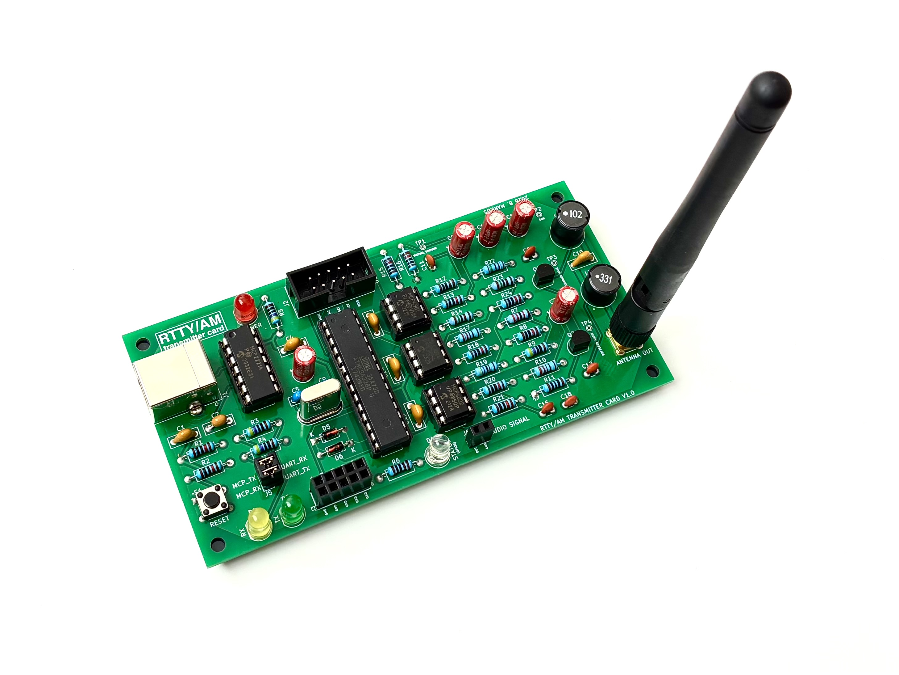
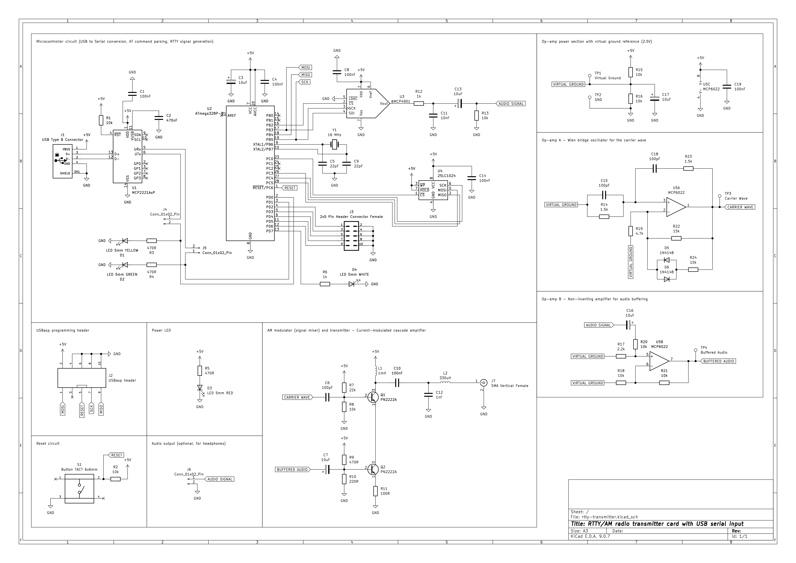
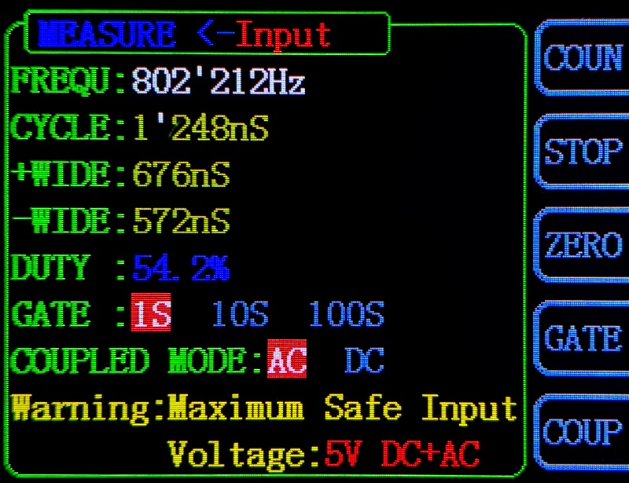
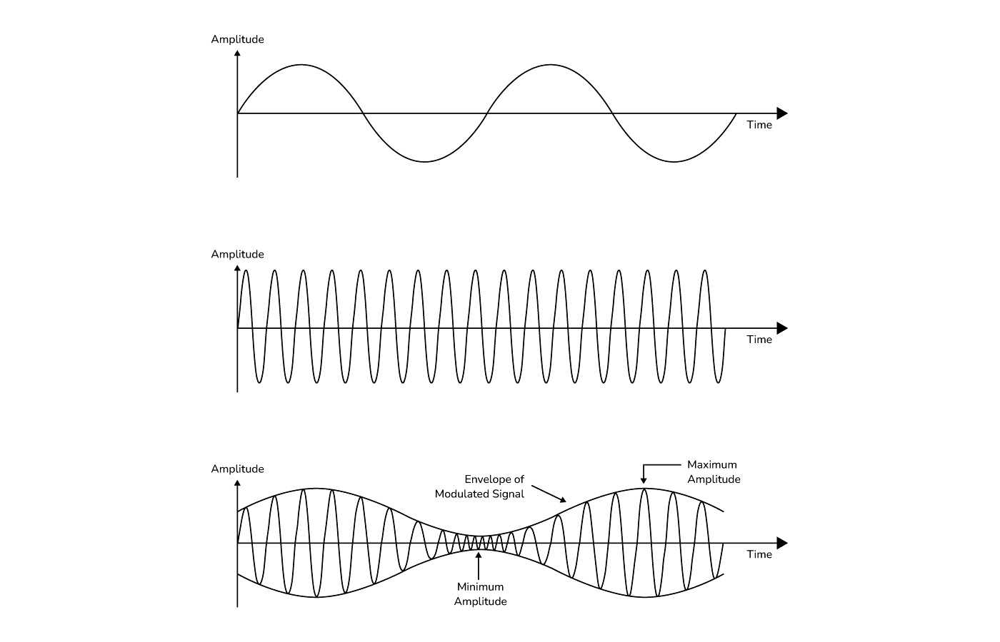
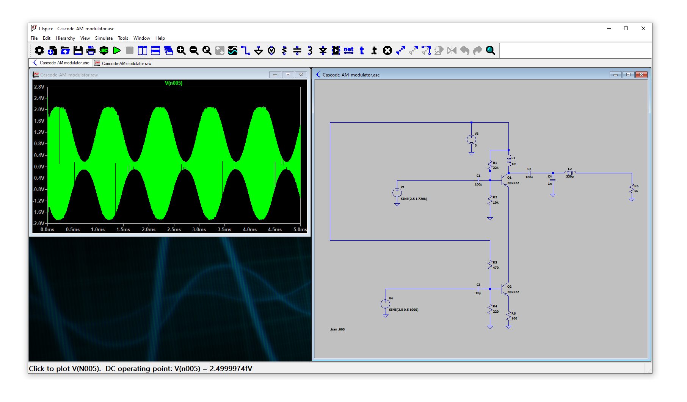
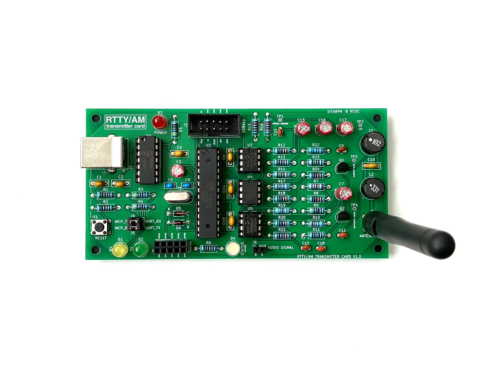
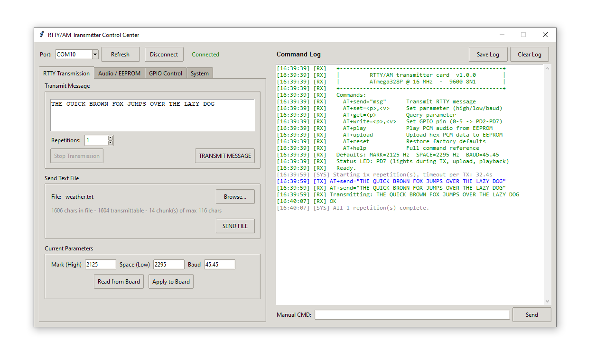
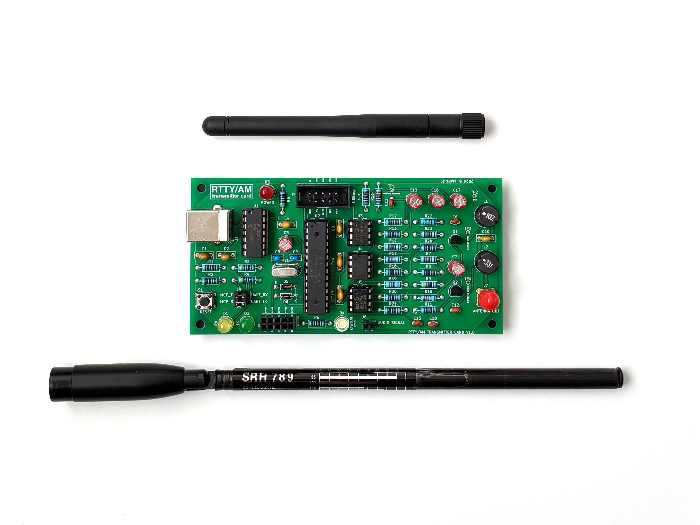
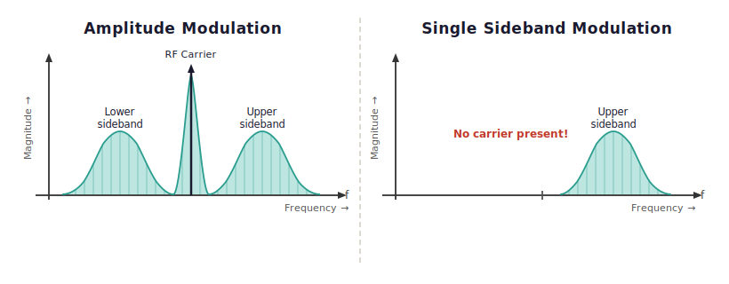

# rtty-transmitter

An ATmega328P-based AM/RTTY transmitter card with USB serial control, Direct Digital Synthesis audio generation, PCM audio playback from SPI EEPROM, and a Wien bridge oscillator RF stage. The board is controlled entirely through an AT command interface over a virtual COM port, and includes a companion Python control center application for Windows, Linux, and macOS.



---

## Table of Contents

- [Overview](#overview)
- [Features](#features)
- [Hardware Description](#hardware-description)
  - [USB Interface and Power Supply](#usb-interface-and-power-supply)
  - [Microcontroller](#microcontroller)
  - [DAC and DDS Engine](#dac-and-dds-engine)
  - [EEPROM for PCM Audio Storage](#eeprom-for-pcm-audio-storage)
  - [Virtual Ground](#virtual-ground)
  - [Wien Bridge Oscillator and Carrier Wave](#wien-bridge-oscillator-and-carrier-wave)
  - [Audio Buffer](#audio-buffer)
  - [RF Output Stage](#rf-output-stage)
  - [Tank Circuit and Antenna Output](#tank-circuit-and-antenna-output)
  - [Signal Chain Summary](#signal-chain-summary)
  - [GPIO Expansion and Status LED](#gpio-expansion-and-status-led)
  - [Bill of Materials](#bill-of-materials)
  - [PCB](#pcb)
- [Firmware](#firmware)
  - [AT Command Interface](#at-command-interface)
  - [RTTY Encoding](#rtty-encoding)
  - [PCM Audio Playback](#pcm-audio-playback)
  - [EEPROM Upload Protocol](#eeprom-upload-protocol)
- [Getting Started](#getting-started)
  - [Requirements](#requirements)
  - [Drivers](#drivers)
  - [Connecting the Board](#connecting-the-board)
- [Building and Flashing the Firmware](#building-and-flashing-the-firmware)
  - [Command-Line Build with avr-gcc and avrdude](#command-line-build-with-avr-gcc-and-avrdude)
  - [Building with MPLAB X IDE](#building-with-mplab-x-ide)
- [Control Center Application](#control-center-application)
  - [Installation](#installation)
  - [Usage](#usage)
- [Antenna Selection and Range](#antenna-selection-and-range)
- [Testing and Reception](#testing-and-reception)
- [Comparison with Official RTTY](#comparison-with-official-rtty)
- [Regulatory Notice](#regulatory-notice)
- [Personal Note](#personal-note)

---

## Overview

This project is a self-contained AM/RTTY transmitter card designed and built around the ATmega328P microcontroller. The board generates FSK (Frequency Shift Keying) audio tones using a software Direct Digital Synthesis engine, feeds those tones through an 8-bit SPI DAC, buffers and amplifies them through a dual op-amp stage, and then modulates them onto a carrier wave produced by a Wien bridge oscillator running at approximately 802 kHz. The resulting AM signal is delivered to an SMA connector for antenna connection.


The board is powered and controlled through a single USB Type B cable. An MCP2221A USB-to-UART bridge makes the board appear as a standard COM port on the host computer, requiring no custom drivers beyond the standard MCP2221 package. All board functions are controlled through a straightforward AT command interface at 9600 baud. A Python-based control center application is included in the tools folder to provide a graphical interface for all features, including RTTY message transmission, text file transmission, PCM audio upload and playback, and GPIO control.

The board can also function as an audio transmitter: an 8-bit, 8 kHz PCM audio file can be uploaded to the onboard 25LC1024 SPI EEPROM (128 KB) and played back over the air using the AT+play command, AM-modulating the 802 kHz carrier with audio content.

---

## Features

- RTTY transmission using ITA-2 Baudot encoding over AM
- Configurable mark/space frequencies and baud rate via AT commands (defaults: MARK 2125 Hz, SPACE 2295 Hz, 45.45 baud)
- Direct Digital Synthesis sine wave generation at 80 kHz sample rate via Timer1 interrupt
- MCP4901 8-bit SPI DAC output
- 25LC1024 SPI EEPROM (128 KB) for PCM audio sample storage
- 8 kHz PCM audio playback from EEPROM via Timer2 interrupt, AM-modulating the carrier
- Wien bridge oscillator carrier wave at approximately 802 kHz
- Current-modulated cascode RF output stage (PN2222A BJTs)
- Tank circuit output filter with loading coil and SMA antenna connector
- MCP2221A USB-to-UART bridge, appearing as a standard COM port at 9600 8N1
- Powered entirely from USB (5V, USB Type B connector)
- Five user-accessible GPIO pins on a 2x5 pin header (J3), including onboard status LED control
- AVR ISP 10-pin shrouded box header for firmware flashing with USBasp or compatible programmer
- 120 x 60 mm, two-layer FR-4 PCB, designed in KiCad 7 and finalized in KiCad 9
- Companion Python control center application for Windows, Linux, and macOS

---

## Hardware Description



### USB Interface and Power Supply

The board is connected to a host PC through a USB Type B connector (J1). Power is drawn from the USB 5V rail and distributed across the board through decoupling capacitors at each IC supply pin.

The USB-to-UART bridge is the MCP2221A (U1), a 14-pin DIP chip from Microchip. When connected, it presents itself to the operating system as a virtual COM port, allowing any standard serial terminal or the included control center application to communicate with the ATmega328P at 9600 8N1. No special kernel modules are required on most systems, though the MCP2221 driver package from Microchip's website may need to be installed on Windows for the COM port to appear. The driver can be downloaded from Microchip's product page for the MCP2221A.

### Microcontroller

The central processing element is the ATmega328P (U2), a 28-pin DIP AVR microcontroller running from a 16 MHz crystal (Y1) with no clock prescaler. It handles all firmware tasks: UART communication with the host through the MCP2221A, hardware SPI to the MCP4901 DAC, bit-bang SPI to the 25LC1024 EEPROM, GPIO control, and the two timer-driven interrupt service routines that form the core of the signal generation pipeline.

The reset line is connected through a capacitor to the DTR signal of the MCP2221A, allowing the control center application to reset the board on connect. A 10-pin shrouded box header (J2) exposes the AVR ISP signals (RESET, SCK, MISO, MOSI) for firmware flashing with a USBasp or compatible programmer.

### DAC and DDS Engine

The MCP4901 (U3) is an 8-bit, single-channel SPI DAC in an 8-pin DIP package. It receives samples from the ATmega328P over hardware SPI running at 8 MHz (F_CPU/2 with SPI2X). Timer1 is configured in CTC mode with OCR1A = 199 and no prescaler, producing an interrupt rate of exactly 80 kHz (16 MHz / 200). Each interrupt advances a 32-bit DDS phase accumulator by a pre-computed increment that determines the output frequency:

```
phase_increment = frequency x 2^32 / 80000
```

The upper 8 bits of the phase accumulator index into a 256-entry sine table stored in SRAM, and the resulting sample is written to the DAC in the same ISR. This produces a clean, digitally synthesized sine wave at the desired audio frequency with a sample rate of 80 kHz, giving well over 40 kHz of usable bandwidth and negligible harmonic content in the RTTY audio band. Setting the phase increment to zero mutes the carrier between transmissions.

For RTTY, the firmware uses two phase increments corresponding to the mark and space frequencies. Bit timing is achieved by loading a tick counter in the same ISR: for 45.45 baud, each bit lasts 80000 / 45.45 = 1760 Timer1 ticks, which equals exactly 22 ms.

### EEPROM for PCM Audio Storage

The 25LC1024 (U4) is a 1 Mbit (131072 byte) SPI EEPROM in an 8-pin DIP package. It is connected to the ATmega328P through a bit-bang SPI interface on PORTC (PC0 = /CS, PC3 = MOSI, PC4 = SCK, PC5 = MISO). A separate bit-bang interface is used for the EEPROM rather than the hardware SPI port so that the hardware SPI bus remains dedicated to the DAC and the time-critical 80 kHz Timer1 ISR is not disrupted by EEPROM accesses.

The EEPROM stores 8-bit unsigned PCM audio samples at 8 kHz. During playback, Timer1 is suspended and Timer2 takes over, configured in CTC mode to fire at exactly 8 kHz (OCR2A = 249, prescaler /8 on a 16 MHz clock). Each Timer2 ISR reads one byte from the EEPROM via bit-bang SPI and writes it directly to the DAC, producing an audio waveform that AM-modulates the carrier. End of audio is signaled by 250 consecutive 0xFF samples, which at 8 kHz corresponds to approximately 31 ms of silence, making it a reliable sentinel value.

### Virtual Ground

The MCP6022 op-amp and the rest of the analog circuit are powered from a single 5V USB supply, which means the supply voltage goes from 0V (GND) to 5V and nothing below. The problem is that a sine wave needs to swing both up and down around a center point. If the center point is 0V, the negative half of the wave would require a negative voltage, which we simply don't have.

The solution is to create a "virtual ground" at 2.5V, a stable mid-point that the op-amp can treat as its reference. The sine wave then swings from around 1.5V up to 3.5V, which looks like ±1V when measured relative to this 2.5V center. The next stage (the transistor base) receives the signal through a coupling capacitor, which strips away the 2.5V DC offset and leaves only the AC swing.

R15 (10k) and R16 (10k) form a simple voltage divider between the 5V supply and GND. Because both resistors are the same value, the midpoint sits at exactly 2.5V. C17 (10uF) is a bypass capacitor connected from this midpoint to GND. It acts like a reservoir that keeps the 2.5V stable and prevents it from wobbling when the op-amp draws current from it. Without this capacitor, the virtual ground voltage would fluctuate with the signal, causing distortion. The virtual ground node is labeled VIRTUAL GROUND in the schematic and is accessible at test point TP1 on the PCB.

### Wien Bridge Oscillator and Carrier Wave

The carrier wave is generated by the first op-amp inside the MCP6022 chip (U5A). It is wired as a Wien bridge oscillator, which is a circuit that produces a sine wave on its own with no input signal (it just runs continuously once power is applied).

The basic idea is that the op-amp has two feedback paths. The first path goes from the output back to the non-inverting input (the "+" pin) and is frequency-selective (it only passes signals at one specific frequency with the right timing to keep the oscillation going). The second path goes from the output back to the inverting input (the "−" pin) and sets the gain. If the gain is slightly above 1 at that specific frequency, the circuit amplifies its own tiny noise until it builds into a stable sine wave.

The frequency is set by R23 (1.5k) and R14 (1.5k) together with C18 (100pF) and C15 (100pF). These four components form the frequency-selective network on the non-inverting input. One resistor-capacitor pair (R14 and C15) connects from the non-inverting input to the virtual ground. The other pair (R23 and C18) connects from the non-inverting input back to the output. This arrangement only passes the right frequency and phase combination to keep the oscillator running. The resonant frequency works out to approximately 802 kHz, which sits in the AM medium-wave broadcast band, meaning any standard AM kitchen radio can receive the signal without special equipment.

```
f = 1 / (2 x pi x R x C)
  = 1 / (2 x pi x 1500 x 100e-12)
  = approximately 802 kHz
```

The gain is set by R22 (15k) and R19 (4.7k). R19 connects from the inverting input ("−" pin, pin 2) to the virtual ground, and R22 connects from the inverting input back to the output. The ratio of these two resistors sets the amplification to just above 3, which is the minimum needed to sustain oscillation in a Wien bridge.

The problem with setting the gain slightly above 3 is that without any correction, the wave would just keep growing until it hits the supply rails and becomes a clipped square wave rather than a clean sine. To prevent this, D5 and D6 (both 1N4148 signal diodes) are connected in anti-parallel (meaning one diode faces one direction and the other faces the opposite direction), together with R24 (10k) in series with them. This whole parallel block sits in parallel with R22. When the oscillation amplitude is small, the diodes don't conduct and R22 does the feedback job on its own. As the amplitude grows and the peaks get tall enough to forward-bias the diodes (around 0.6V), they start conducting and effectively lower the feedback resistance, which brings the gain back down and stops the wave from growing further. This keeps the output as a clean, stable sine wave at about 2V peak-to-peak.

The MCP6022 was chosen because it is a rail-to-rail op-amp, meaning its output can swing all the way to 0V and 5V, and it has enough speed (10 MHz gain-bandwidth product) to still have useful gain at 802 kHz.

The output of the oscillator comes out of pin 1 of U5 and is labeled CARRIER WAVE in the schematic. It is accessible at test point TP3 on the PCB. The frequency counter measurement below was taken directly at TP3 on the assembled board.



### Audio Buffer

The second op-amp inside the MCP6022 (U5B) takes the audio signal from the DAC and prepares it for the RF output stage.

The DAC output connects through R12 (1k) and C13 (10uF) to form a low-pass RC filter that smooths out the stepped output of the DAC, followed by AC coupling into the op-amp. R17 (2.2k) connects the non-inverting input (pin 5) to the virtual ground, which biases the input to the 2.5V midpoint so the op-amp is correctly centered. R20 (10k) and R21 (10k) set the gain: R21 connects from the inverting input (pin 6) to the virtual ground, and R20 connects from the inverting input back to the output (pin 7). With both resistors the same value, the gain works out to 2, which doubles the audio signal amplitude before it reaches the transistor stage. C16 (10uF) at the output AC-couples the buffered signal, stripping the 2.5V DC offset before the signal reaches the transistor base.

The buffered audio signal is accessible at test point TP4 on the PCB.

### RF Output Stage

This is where amplitude modulation actually happens. The carrier wave from the Wien bridge oscillator and the buffered audio signal from the op-amp come together in a two-transistor circuit built around Q1 and Q2 (both PN2222A NPN transistors).

Think of the circuit as a single pipe carrying current from the 5V supply down to GND. Q1 sits at the top of the pipe and Q2 sits at the bottom, stacked in series.

Q2 is the audio transistor. Its base receives the buffered audio signal through C7 (10uF), a coupling capacitor that passes AC audio while blocking DC. R9 (470R) connects the base to the 5V supply and R10 (220R) connects it to GND. These two resistors together form a bias voltage divider that holds the base at about 2V when no audio signal is present, keeping Q2 partially open at all times. This is important because if Q2 were completely off when the audio signal is at its lowest point, the output would cut out and you would hear distortion. The audio signal riding on top of this 2V bias makes Q2 open and close gradually, controlling how much current flows through the bottom of the pipe at audio frequencies. R11 (100R) is the emitter resistor, sitting between the emitter of Q2 and GND. Without it, a small rise in temperature would make Q2 conduct more, which heats it up further, which makes it conduct even more, a runaway loop that would destroy the transistor. R11 limits the maximum current and breaks that loop.

Q1 is the RF transistor. Its base receives the 802 kHz carrier sine wave from the oscillator through C6 (100pF), a coupling capacitor for the RF signal. R7 (22k) connects the base to the 5V supply and R8 (10k) connects it to GND, forming the bias voltage divider that keeps Q1 in the right operating region. The carrier drives Q1 to switch on and off 802,000 times per second, chopping the current in the pipe at the carrier frequency.

The result of stacking Q1 on top of Q2 is that Q1 chops the current into rapid RF pulses, but the size of those pulses is controlled by how open Q2 is, which follows the audio waveform. On an oscilloscope, the output at Q1's collector looks like a 802 kHz sine wave that grows and shrinks in amplitude following the audio signal. That is amplitude modulation.



L1 (1mH) is an RF choke, an inductor specifically used to block high-frequency signals from travelling somewhere they shouldn't. It connects between the 5V supply and Q1's collector. It has almost zero DC resistance, so it passes the full supply voltage to the transistors without dropping it. But at 802 kHz, a 1mH inductor has an impedance of roughly 5000 ohms, and it acts like a wall for RF. So the RF signal generated at Q1's collector cannot go back toward the power supply through L1. Instead it is forced to flow out through C10 (100nF) toward the antenna. As a side effect, L1 also lets Q1's collector voltage momentarily swing higher than 5V due to inductive kickback, which increases the available output swing.

Before building the circuit on PCB, the two-transistor cascode AM modulator was simulated in LTspice to verify that the topology produces a clean AM output. The simulation confirmed the expected behaviour: a carrier wave whose envelope is cleanly modulated by the audio signal, with no overmodulation or clipping. The LTspice project file is included in the ltspice folder of the repository.



### Tank Circuit and Antenna Output

After Q1's collector, the signal passes through a small matching network before reaching the antenna connector.

C10 (100nF) is a DC blocking capacitor, and its job is to pass AC signals while stopping DC from getting through. Q1's collector sits at roughly 5V DC because L1 feeds the supply voltage directly with no resistive drop. C10 blocks this DC so it never reaches the antenna connector, while passing the 802 kHz AC signal through easily (at 802 kHz a 100nF capacitor has only about 2 ohms of impedance, so it is essentially invisible to the signal).

After C10, the signal arrives at a node where C12 (1nF) connects to GND and L2 (330uH) continues in series toward the antenna. C12 and L2 together form a resonant tank circuit. At 802 kHz, L2 and C12 resonate, meaning they create a high-impedance "bandpass" effect at the carrier frequency that suppresses harmonics and other noise products from the transistor stage. This keeps the transmitted spectrum relatively clean.

L2 (330uH) also serves as a loading coil, sometimes called a base-loading inductor. The antennas this board is designed to use are very short (maybe 0.3 to 1 meter) compared to a proper quarter-wave antenna at 802 kHz, which would need to be about 93 meters long. A short antenna looks like a small capacitor to the circuit, with very high impedance, and most of the RF energy would just bounce back rather than radiate. L2 introduces an inductive reactance that partially cancels out this capacitive effect, making the short antenna behave more like a resistive load and allowing more of the power to actually be radiated.

The output of L2 connects to J7, a vertical SMA female connector on the edge of the board, where any standard SMA antenna can be attached.

### Signal Chain Summary

Now that all the individual blocks have been described, the complete signal path from firmware to antenna is:

```
DDS engine (Timer1 ISR, 80 kHz)
  --> MCP4901 DAC (hardware SPI, 8 MHz)
    --> R12 --> op-amp buffer (U5B)
      --> RF output stage (Q2 audio transistor / Q1 RF transistor cascode)
        --> C10 DC block (100 nF) --> L2 loading coil (330 uH) / C12 tank (1 nF)
          --> SMA antenna connector (J7)

Audio playback path (Timer2 ISR, 8 kHz):
  25LC1024 EEPROM --> bit-bang SPI read --> MCP4901 DAC --> same path as above

Carrier wave (continuous, hardware oscillator):
  Wien bridge oscillator (U5A, R15/R16/C6/C15) --> Q1 base via 1 nF capacitor
```

### GPIO Expansion and Status LED

Five GPIO pins (PD2 through PD6, mapped as AT command pins 0 through 4) are brought out to the 2x5 female pin socket header J3. These pins are configured as outputs and can be driven high or low through the AT+write command, making them available for user applications such as driving relays, LEDs, or interfacing with other hardware.

The onboard status LED (D4, white 5mm LED) is connected to PD7 through R6. It is mapped as GPIO pin 5 in the AT command interface and lights automatically during RTTY transmission, EEPROM upload, and audio playback. It can also be controlled directly with AT+write=5,1 and AT+write=5,0.

A tactile reset button (S1, 6x6mm) is connected to the ATmega328P reset line for manual resets without needing to disconnect USB.

### Bill of Materials

| Reference | Qty | Value / Part |
|---|---|---|
| U1 | 1 | MCP2221A-I/P (USB-UART bridge, DIP-14) |
| U2 | 1 | ATmega328P-P (MCU, DIP-28) |
| U3 | 1 | MCP4901 (8-bit SPI DAC, DIP-8) |
| U4 | 1 | 25LC1024 (1 Mbit SPI EEPROM, DIP-8) |
| U5 | 1 | MCP6022 (dual rail-to-rail op-amp, DIP-8) |
| Q1, Q2 | 2 | PN2222A (NPN BJT, TO-92) |
| Y1 | 1 | 16 MHz crystal (HC49-U) |
| L1 | 1 | 1 mH radial inductor |
| L2 | 1 | 330 uH radial inductor |
| D1 | 1 | LED 5mm Yellow |
| D2 | 1 | LED 5mm Green |
| D3 | 1 | LED 5mm Red |
| D4 | 1 | LED 5mm White |
| D5, D6 | 2 | 1N4148 signal diode |
| J1 | 1 | USB Type B connector |
| J2 | 1 | 2x5 shrouded box header (AVR ISP) |
| J3 | 1 | 2x5 female pin header (GPIO) |
| J7 | 1 | SMA vertical female connector |
| S1 | 1 | Tactile button 6x6mm |
| C1,C4,C8,C10,C14,C19 | 6 | 100nF |
| C2 | 1 | 470nF |
| C3,C7,C13,C16,C17 | 5 | 10uF electrolytic |
| C5, C9 | 2 | 22pF (crystal load) |
| C6,C15,C18 | 3 | 100pF |
| C11 | 1 | 10nF |
| C12 | 1 | 1nF |
| R1,R2,R8,R13,R15,R16,R18,R20,R21,R24 | 10 | 10k |
| R3,R4,R5,R9 | 4 | 470R |
| R6, R12 | 2 | 1k |
| R7 | 1 | 22k |
| R10 | 1 | 220R |
| R11 | 1 | 100R |
| R14, R23 | 2 | 1.5k |
| R17 | 1 | 2.2k |
| R19 | 1 | 4.7k |
| R22 | 1 | 15k |

### PCB



The PCB is a two-layer FR-4 board measuring 120 x 60 mm, 1.6 mm thick. It was designed in KiCad 7 and the project was finalized in KiCad 9. The board was manufactured by JLCPCB with green soldermask, white silkscreen, HASL (leaded) surface finish, and 1 oz outer copper weight. All components are through-hole for ease of hand assembly. Gerber files, drill files, and the complete KiCad project files are included in the schematic folder of this repository.

---

## Firmware

The firmware is a single C source file (rtty-transmitter/main.c), written for avr-gcc and targeting the ATmega328P at 16 MHz. It has no external library dependencies beyond the standard avr-libc. The current version is v1.0.0.

Once the board is connected and the MCP2221 driver is installed (see the Getting Started section), it appears as a standard COM port on the host computer. From that point, any serial terminal program can be used to communicate with it directly: PuTTY, Tera Term, the Arduino Serial Monitor, minicom on Linux, or the built-in terminal of any IDE. Set the port to 9600 baud, 8 data bits, no parity, 1 stop bit (9600 8N1). On connecting and pressing Enter, the firmware prints a startup banner listing all available commands and the current defaults. No special software is needed to use the board at a basic level.

### AT Command Interface

The firmware communicates at 9600 8N1. Commands are typed as plain text and terminated with a carriage return (Enter key in any terminal). All commands start with the letters AT, which stands for "attention" and is a convention inherited from classic modem command sets. The board echoes each character as you type it, so you can see what you are entering. It responds with OK on success or Error: ... on failure.

| Command | Description |
|---|---|
| AT | Echo test. Returns OK if the board is responsive. |
| AT+send="message" | Encode and transmit message as Baudot RTTY. Message is converted to upper case. Characters not representable in ITA-2 are silently skipped. |
| AT+set=param,value | Set a runtime parameter. Valid parameters: high (mark frequency in Hz), low (space frequency in Hz), baud (baud rate, e.g. 45.45). |
| AT+get=param | Query the current value of a parameter. Valid parameters: high, low, baud. |
| AT+write=pin,value | Set a GPIO pin. Pin 0-4 map to PD2-PD6 (header J3). Pin 5 controls the status LED on PD7. Value is 0 or 1. |
| AT+play | Play the 8-bit PCM audio stored in EEPROM. Suspends Timer1 and uses Timer2 at 8 kHz. Ends automatically when 250 consecutive 0xFF bytes are encountered. |
| AT+upload | Enter EEPROM upload mode. Accepts raw hex bytes (space or newline separated, e.g. A3 4F 00 ...) and writes them to the EEPROM starting at address 0. The session ends automatically after a configurable idle timeout with no incoming data. |
| AT+reset | Restore factory defaults: MARK = 2125 Hz, SPACE = 2295 Hz, BAUD = 45.45. |
| AT+help | Print a full command reference to the serial terminal. |

Default parameters on startup:

```
MARK  = 2125 Hz
SPACE = 2295 Hz
BAUD  = 45.45
```

These are the standard ITA-2 tones used in traditional 45.45 baud RTTY, chosen for maximum compatibility with RTTY decoders.

A few practical examples to get started quickly:

```
AT
```
Expected response: OK. Use this to confirm the board is alive and the COM port is working.

```
AT+send="HELLO WORLD"
```
Encodes and transmits the text as a Baudot RTTY burst. The status LED lights during transmission.

```
AT+set=baud,50
AT+set=high,2125
AT+set=low,2295
```
Changes the baud rate to 50 baud (another common RTTY speed) while keeping the standard tones.

```
AT+get=baud
```
Reads back the current baud rate. The board will respond with the numeric value followed by OK.

```
AT+write=5,1
AT+write=5,0
```
Turns the onboard status LED on, then off.

```
AT+play
```
Plays the audio sample stored in EEPROM over the AM carrier. Make sure an audio file has been uploaded first with AT+upload or the control center application.

### RTTY Encoding

RTTY (Radio Teletype) is a digital text transmission mode where each character is encoded as a series of tones. This board uses the ITA-2 standard, also called Baudot, which dates back to early telegraph and teletype machines. Understanding how Baudot works helps in understanding what the firmware is actually doing when you call AT+send.

Baudot is a five-bit code. Five bits can represent 32 different combinations (2 to the power of 5). That is not enough for the full alphabet plus digits plus punctuation. The solution is to have two separate tables of 32 characters each: the Letters table (LTRS) and the Figures table (FIGS). A special shift code switches the decoder between the two tables, much like holding Shift on a keyboard. The transmitter sends a LTRS code before a run of letters, and a FIGS code before a run of numbers or punctuation.

Here are the two tables as implemented in the firmware:

Letters table (LTRS shift active):

| Code  | Char | Code  | Char | Code  | Char | Code  | Char |
|-------|------|-------|------|-------|------|-------|------|
| 11000 | A    | 10011 | B    | 01110 | C    | 10010 | D    |
| 10000 | E    | 10110 | F    | 01011 | G    | 00101 | H    |
| 01100 | I    | 11010 | J    | 11110 | K    | 01001 | L    |
| 00111 | M    | 00110 | N    | 00011 | O    | 01101 | P    |
| 11101 | Q    | 01010 | R    | 10100 | S    | 00001 | T    |
| 11100 | U    | 01111 | V    | 11001 | W    | 10111 | X    |
| 10101 | Y    | 10001 | Z    | 00100 | SP   | 01000 | LF   |

Figures table (FIGS shift active):

| Code  | Char | Code  | Char | Code  | Char | Code  | Char |
|-------|------|-------|------|-------|------|-------|------|
| 11000 | -    | 10011 | ?    | 01110 | :    | 10010 | $    |
| 10000 | 3    | 10110 | !    | 01011 | &    | 00101 | #    |
| 01100 | 8    | 11010 | (    | 11110 | )    | 01001 | .    |
| 00111 | ,    | 00110 | 9    | 00011 | 0    | 01101 | 1    |
| 11101 | 1    | 01010 | '    | 10100 | 5    | 00001 | 7    |
| 11100 | 7    | 01111 | ;    | 11001 | 2    | 10111 | /    |
| 10101 | 6    | 10001 | "    | 00100 | SP   | 01000 | LF   |

As an example, to send the letter H, the firmware looks up 00101 in the LTRS table and transmits those five bits. To then send the digit 3, it first sends the FIGS shift code 11011, then transmits 10000 (which means 3 in the FIGS table).

Each five-bit character code is framed with a start bit and stop bits in the same way a UART serial protocol works: one start bit (mark tone, logical 0), the five data bits, and two stop bits (space tone, logical 1). On the receiving end, a RTTY decoder listens for the start bit transition to synchronize, then samples the five data bits, then waits for the stop bits before looking for the next start bit. The firmware also sends a carriage return and a line feed as a preamble before each message so the receiving decoder has time to lock on.

Bit timing is derived directly from the 80 kHz Timer1 tick rate. For 45.45 baud, each bit period is 1760 Timer1 ticks (80000 / 45.45 = 1760), which corresponds exactly to 22 ms per bit. The firmware spins on the tick countdown in the ISR, so bit timing is cycle-accurate regardless of main-loop activity. The baud rate can be changed with AT+set=baud,value to any value the DDS can produce at that tick resolution.

### PCM Audio Playback

The board can transmit audio over the AM carrier, not just RTTY tones. The audio is stored in the onboard EEPROM as raw PCM samples and played back by the AT+play command.

PCM (Pulse Code Modulation) is the simplest digital audio format: every sample is a number representing the amplitude of the sound at that instant in time. The firmware uses 8-bit unsigned PCM at 8 kHz, which means each sample is a single byte (0-255, where 128 represents silence/midpoint), and 8000 samples are played per second. This is the same format as old telephone audio and is perfectly adequate for speech and simple sounds. The maximum recording length is 131072 bytes divided by 8000 samples per second, which gives approximately 16.4 seconds of audio.

Four ready-to-use sample files are included in the `assets/pcm-samples` directory and can be uploaded directly through the control center without any conversion. Three are music clips (`dance-electronic.raw`, `energetic-rock.raw`, `pop-upbeat.raw`), and one is a 1 kHz sine wave (`sine-1khz.raw`) useful for testing and verifying the audio chain. Of course, any audio can also be converted from any source using Audacity as described in the following section.

To prepare an audio file for upload, use Audacity (free, available at https://www.audacityteam.org):

1. Open your audio file in Audacity, or record directly.
2. If the audio is stereo, go to Tracks > Mix > Mix Stereo Down to Mono.
3. In the bottom-left of the track, set the sample rate to 8000 Hz.
4. Go to File > Export Audio.
5. In the export dialog, select "Other uncompressed files" as the format.
6. Click Options and set Header to "RAW (header-less)" and Encoding to "Unsigned 8-bit PCM."
7. Save the file with any name (for example, audio.raw).

The resulting .raw file is the exact binary data that needs to be uploaded to the EEPROM.

During AT+play, the firmware suspends Timer1 (which drives the DDS engine and any in-progress RTTY transmission), starts Timer2 in CTC mode at exactly 8 kHz, and begins reading samples from the EEPROM one byte at a time via bit-bang SPI. Each sample is written directly to the MCP4901 DAC, which produces the audio waveform. This waveform feeds through the op-amp buffer and into the RF output stage, where it AM-modulates the 802 kHz carrier from the Wien bridge oscillator exactly as the DDS-generated RTTY tones do. The status LED lights for the entire duration of playback. After playback ends (detected by 250 consecutive 0xFF bytes, which serve as an end-of-audio marker), Timer2 is stopped, Timer1 is restarted, and the firmware returns to the AT command loop ready for the next command.

### EEPROM Upload Protocol

The AT+upload command puts the firmware into upload mode. The protocol is acknowledgement-driven: the host sends one 32-byte chunk at a time and waits for the board to respond before sending the next one. This guarantees reliable delivery regardless of how fast the host sends data.

The exact sequence is:

1. The host sends `AT+upload\r`.
2. The board responds with `READY\r\n` when it is ready to receive data.
3. The host sends raw data as exactly 64 ASCII hex characters (32 bytes encoded as hex pairs, no spaces or separators between characters in a chunk), for example `A34F00...`.
4. After processing each 32-byte chunk and writing it to the EEPROM page, the board responds with `>` to request the next chunk.
5. The host repeats steps 3-4 for each chunk.
6. After all chunks are sent, the host stops sending. The board's internal idle timeout (approximately 1.5 seconds) fires, it finalizes any remaining buffered page writes, and responds with `OK\r\n`.

The data is padded to a 32-byte boundary with 0xFF bytes before transmission. 0xFF is the erased state of EEPROM memory and also serves as the end-of-audio sentinel during playback (250 consecutive 0xFF bytes signal end of audio to the firmware).

The control center application handles all of this automatically. For users who want to write their own upload script, here is a minimal Python example that matches this exact protocol:

```python
import serial
import time

CHUNK_SIZE = 32   # 32 bytes per chunk = 64 hex characters sent per chunk

def upload_audio(port, raw_bytes):
    # Pad to a 32-byte boundary with 0xFF fill
    pad = CHUNK_SIZE - (len(raw_bytes) % CHUNK_SIZE)
    if pad != CHUNK_SIZE:
        raw_bytes += b'\xFF' * pad

    ser = serial.Serial(port, 9600, timeout=5)
    time.sleep(0.5)                          # Wait for board to reset on connect
    ser.reset_input_buffer()

    # Step 1: Send upload command and wait for READY
    ser.write(b"AT+upload\r")
    response = ""
    deadline = time.time() + 4.0
    while "READY" not in response and time.time() < deadline:
        response += ser.read(ser.in_waiting or 1).decode(errors="replace")
    if "READY" not in response:
        raise Exception("Board did not respond with READY")

    time.sleep(0.2)
    print("Board ready. Sending chunks...")

    # Step 2: Send data in 32-byte chunks, wait for '>' ack after each
    hex_data = raw_bytes.hex().upper()
    total_chunks = len(hex_data) // (CHUNK_SIZE * 2)

    for i, offset in enumerate(range(0, len(hex_data), CHUNK_SIZE * 2)):
        chunk_hex = hex_data[offset : offset + CHUNK_SIZE * 2]
        ser.write(chunk_hex.encode('ascii'))
        ser.flush()

        # Wait for the '>' acknowledgement from the board
        ack = ""
        deadline = time.time() + 5.0
        while '>' not in ack and time.time() < deadline:
            ack += ser.read(ser.in_waiting or 1).decode(errors="replace")
        if '>' not in ack:
            raise Exception(f"Timeout waiting for '>' at chunk {i}")

        print(f"  Chunk {i+1}/{total_chunks} OK")

    # Step 3: Wait for the board's idle timeout to fire and send final OK
    final = ""
    deadline = time.time() + 30.0
    while "OK" not in final and time.time() < deadline:
        final += ser.read(ser.in_waiting or 1).decode(errors="replace")

    print("Upload complete.")
    ser.close()

# Example usage:
with open("audio.raw", "rb") as f:
    data = f.read()

upload_audio("COM3", data)   # Replace COM3 with your port, e.g. /dev/ttyUSB0
```

The key point is that there is no fixed delay between chunks. The timing is entirely controlled by the board's `>` acknowledgement. The host only sends the next chunk after receiving `>`, which means the EEPROM page write cycle has already completed on the board side before the next chunk arrives.

---

## Getting Started

### Requirements

- ATmega328P-based board (this project)
- USB Type B cable
- A PC running Windows, Linux, or macOS
- Python 3.7 or later with the pyserial package (for the control center)
- avr-gcc and avrdude (for building and flashing firmware from the command line)
- A USBasp or compatible AVR ISP programmer (for firmware flashing)

### Drivers

On most Linux distributions no additional drivers are needed. On Windows, if the board does not appear as a COM port after connecting, install the MCP2221 driver from Microchip's website:

https://www.microchip.com/en-us/product/mcp2221a

### Connecting the Board

1. Connect the board to the PC with a USB Type B cable.
2. The power LED should illuminate.
3. On Windows, open Device Manager and confirm a new COM port has appeared under Ports (COM and LPT). On Linux the device will appear as /dev/ttyUSB0 or similar.
4. Open a serial terminal at 9600 8N1 (or launch the control center application) and press Enter. The firmware startup banner should appear, listing the available commands.

---

## Building and Flashing the Firmware

The firmware consists of a single source file: rtty-transmitter/main.c. No special IDE is required.

### Command-Line Build with avr-gcc and avrdude

Install avr-gcc and avrdude for your platform (on Debian/Ubuntu: `sudo apt install gcc-avr binutils-avr avrdude`; on Windows, install WinAVR or the Atmel toolchain).

Navigate to the rtty-transmitter directory and run:

```sh
avr-gcc -mmcu=atmega328p -DF_CPU=16000000UL -O1 \
    -funsigned-char -funsigned-bitfields \
    -ffunction-sections -fdata-sections \
    -fpack-struct -fshort-enums \
    -Wall -o main.elf main.c

avr-objcopy -O ihex main.elf main.hex
```

Then flash with your USBasp programmer:

```sh
avrdude -c usbasp -p m328p -U flash:w:main.hex
```

If avrdude reports a signature mismatch or permission error on Linux, ensure you are in the dialout group or run with sudo.

The final firmware image is approximately 10.4 KB, well within the ATmega328P's 32 KB Flash limit.

### Building with MPLAB X IDE

The repository includes an MPLAB X IDE project in the rtty-transmitter/nbproject directory. The project has two build configurations:

- default: Compiles only, produces the hex file.
- flash: Identical to default, but runs avrdude automatically after a successful build to flash the connected board via USBasp. The post-build step is:

```
avrdude -c usbasp -p m328p -U flash:w:${ImagePath}
```

where ImagePath is the MPLAB X macro pointing to the final production hex. With the flash configuration selected, clicking Build Main Project compiles the firmware and programs the board in a single step.

The project was developed with MPLAB X IDE v6.25 and the Microchip ATmega_DFP 3.3.279 device pack. The compiler used is avr-gcc from the Atmel Studio 7 toolchain.

A typical successful build and flash output looks like this:

```
avrdude: device signature = 0x1e950f (probably m328p)
avrdude: erasing chip
avrdude: writing 10444 bytes flash ...
Writing | ################################################## | 100% 4.62s
avrdude: 10444 bytes of flash verified
avrdude done.  Thank you.
BUILD SUCCESSFUL (total time: 10s)
```

---

## Control Center Application



The tools/rtty-transmitter-control-center.py Python script provides a graphical user interface for all board functions. It is built with Tkinter and requires no installation beyond Python 3 and the pyserial package.

### Installation

```sh
pip install pyserial
python tools/rtty-transmitter-control-center.py
```
### Usage

The window is split into two columns. The right column contains the command log and a Manual CMD entry field, both always visible. Outgoing commands appear in blue, board responses in green, system messages in grey, warnings in orange, and errors in red. The log can be cleared or saved with the buttons above it. Any AT command can be typed into the Manual CMD field and sent with Enter.
The left column has a connection bar at the top and four tabs below it. Select the COM port, click Refresh if needed, then click Connect. On a successful connection the status label turns green, the application sends an AT echo test, and reads back the current RTTY parameters automatically.

The RTTY Transmission tab covers sending messages and files. The text area at the top is pre-filled with a test pangram; edit it and click TRANSMIT MESSAGE to send. A Repetitions spinbox (1 to 1000) repeats the same message back to back, and Stop Transmission aborts an in-progress multi-repetition send. Below that, the Send Text File section lets you browse for a plain text file; once selected the application shows how many chunks it will be split into and the SEND FILE button becomes active. Files are filtered to the ITA-2 character set, newlines replaced with spaces, and split into 116-character chunks, each sent as a separate AT+send with acknowledgement before the next. At the bottom of the tab, the Current Parameters section shows the Mark, Space, and Baud values read from the board. Edit any field and click Apply to Board to update them, or Read from Board to refresh.

The Audio / EEPROM tab has a PLAY AUDIO button at the top that sends AT+play immediately. Below it, the Upload New Audio section lets you browse for an audio file. The application auto-detects raw binary (8-bit unsigned PCM at 8 kHz), a hex-dump text file, or a WAV file (WAV files trigger a warning since the header bytes will be included). After selecting a valid file within the 128 KB EEPROM limit, the file name, size, and estimated upload time are shown, and the Upload to EEPROM button becomes active. A progress bar and percentage label track the upload chunk by chunk.

The GPIO Control tab shows six panels in a 2x3 grid for GPIO 0 through GPIO 5 (PD2 through PD7). Each panel has a HIGH and a LOW button that sends the corresponding AT+write command immediately. GPIO 5 on PD7 is the onboard yellow status LED.

The System tab has three buttons: Check Connection (sends AT), Factory Reset (sends AT+reset), and Help (sends AT+help, printing the full command reference to the log).

---

## Antenna Selection and Range



The SMA connector (J7) accepts any standard SMA antenna. The board was tested with two antennas:

1. A generic ISM-band whip antenna primarily designed for 433/868/915 MHz use. While functional as a receive and general-purpose antenna, its electrical length is far shorter than the quarter-wave length at 802 kHz (approximately 93 meters), so it is not well matched to the transmit frequency and delivers limited range.

2. A telescopic SRH-789 multiband antenna, which can be extended to approximately 1 meter. This antenna performs noticeably better at 802 kHz, and with it a range of a few meters was achieved in testing. In one additional test, a length of SMA extension cable (approximately 1 meter) was inserted between the board's SMA connector and the SRH-789, effectively increasing the total radiating length. This further improved the range, demonstrating that even a simple increase in antenna conductor length has a measurable effect at medium-wave frequencies.

In both cases, a properly resonant loading coil or a ground-plane matched to the medium-wave band would significantly improve performance. With the default low-power output stage and a short antenna, the practical range of this board is limited to a few meters, which is entirely by design and appropriate for a bench demonstration or close-range testing setup.

Note that transmission in the AM medium-wave band is regulated in most countries. Always verify your local regulations before transmitting. See the Regulatory Notice section below.

---

## Testing and Reception

The board was tested using a standard portable AM/FM kitchen radio tuned to 802 kHz. With the radio placed within range, the RTTY tone bursts are clearly audible as alternating beeps corresponding to the mark and space tones.

For decoding, GRITTY 1.3 by Afreet Software was used. GRITTY is a free RTTY decoding program that processes the audio received by a soundcard and decodes the bit stream in real time. In the test setup, the radio received the AM signal and played back the audio tones, which were picked up by the laptop's built-in microphone and fed into GRITTY, which successfully decoded the transmitted text.

The AT+play audio playback function was also tested. A short 8-bit, 8 kHz PCM audio sample was uploaded to the EEPROM using the control center application and played back with AT+play. The audio was clearly audible through the kitchen radio receiver, with good intelligibility and no significant distortion. The 8 kHz sample rate is sufficient for voice and simple audio content, and the AM carrier does a faithful job of conveying the waveform at close range.

One observation during testing: the SPI interface between the ATmega328P and the EEPROM can produce noise that couples into the RF output, sometimes audible as a faint background interference. Standard bypass capacitors are placed at the relevant supply pins, but as with any RF design, further layout optimization and shielding can always improve results.

---

## Comparison with Official RTTY

This board transmits RTTY tones using conventional AM (amplitude modulation): the audio FSK signal from the DDS engine directly modulates the amplitude of the 802 kHz carrier produced by the Wien bridge oscillator. Understanding how this differs from professional RTTY is useful for anyone looking to extend or adapt the project.

**Modulation method:** Official RTTY, as used by amateur radio operators, coast stations, and maritime services, uses SSB (single-sideband) modulation. The operator feeds the FSK audio tones into the microphone or audio input of an SSB transceiver, and the transceiver shifts those tones up to the operating frequency, transmitting only one sideband. The mark and space tones then appear on the air as two discrete RF frequencies separated by the audio shift (typically 170 Hz for narrow-shift RTTY, or 850 Hz for wide-shift). In AM mode as used by this board, both sidebands are transmitted and the carrier is present at full strength, which wastes power and doubles the occupied bandwidth.



**Frequency bands:** Amateur RTTY operates on designated segments within the HF amateur bands. Typical allocations and commonly used frequencies are:

- 80 meters: around 3580-3600 kHz (Europe) and 3570-3600 kHz (North America)
- 40 meters: around 7035-7043 kHz (Europe) and 7080-7125 kHz (North America)
- 20 meters: around 14080-14099 kHz, with heavy activity at 14085 kHz
- 15 meters: around 21080-21099 kHz
- 10 meters: around 28080-28099 kHz

This board transmits at 802 kHz, which is in the AM medium-wave broadcast band (526-1606 kHz). This band is not allocated for amateur RTTY. It was chosen here because a standard AM kitchen radio can receive it without any specialized equipment, making the board immediately useful for demonstration and experimentation.

**Baud rate and shift:** The most common amateur RTTY standard is 45.45 baud with a 170 Hz shift. This means the mark tone sits at one audio frequency and the space tone sits 170 Hz away. This firmware defaults to 2125 Hz (mark) and 2295 Hz (space), which is exactly the 170 Hz narrow-shift standard used in modern amateur RTTY, making it directly compatible with any ITA-2 RTTY decoder such as GRITTY, Fldigi, or MMTTY when the audio is recovered from the AM carrier.

Some older or maritime RTTY systems used 850 Hz wide-shift at 50 baud, and some weather fax and RTTY broadcast services used 50 baud with 450 Hz shift. The firmware's AT+set command allows the mark frequency, space frequency, and baud rate to be changed freely, so any of these variants can be reproduced.

**What a typical professional RTTY transmitter looks like:** A conventional amateur RTTY station consists of an SSB transceiver (for example a Kenwood TS-590, Icom IC-7300, or Yaesu FT-991) connected to a PC running a soundcard-based RTTY modem such as Fldigi or MMTTY. The software generates the FSK audio tones at 2125 Hz and 2295 Hz, sends them into the transceiver's audio input, and the transceiver upconverts and transmits them on, say, 14085 kHz USB. The radiated signal occupies roughly 500 Hz of spectrum, carries no pilot carrier, and can be received thousands of kilometers away with a modest antenna and a sensitivity-optimized receiver.

**How to turn this board into a proper RTTY transmitter:** The firmware is already producing standard ITA-2 Baudot encoding at the correct baud rate and shift. The DDS audio engine output is present at the pin socket J6 (marked as "Audio Signal"). To transmit proper SSB RTTY on the amateur bands, this audio output could be fed directly into the microphone input or the auxiliary audio input of any SSB transceiver, bypassing the Wien bridge oscillator and the on-board RF stage entirely. The transceiver then handles upconversion, amplification, and antenna matching at the desired amateur frequency. No firmware changes would be needed, since the mark/space tones and baud rate are already standard.

---

## Regulatory Notice

Transmission on the AM medium-wave band (526-1606 kHz) is regulated in most countries. In many jurisdictions, unlicensed low-power transmitters are permitted below a defined field strength limit, but the rules vary significantly by country and frequency band. It is the user's responsibility to verify the applicable regulations in their country before operating this device as a transmitter. The board's output power is intentionally low, and with a short, unmatched antenna the radiated field is extremely limited, but this does not substitute for checking local law.

---

## Personal Note

I have always been fascinated by RTTY and medium-wave AM transmitters. The first idea for a project like this came when I was a kid, experimenting with home-built oscillators and imagining the day I would be able to design something that could transmit a signal to a small radio across the room. This board is a milestone in a long journey, and I am glad it worked out. The journey continues.
